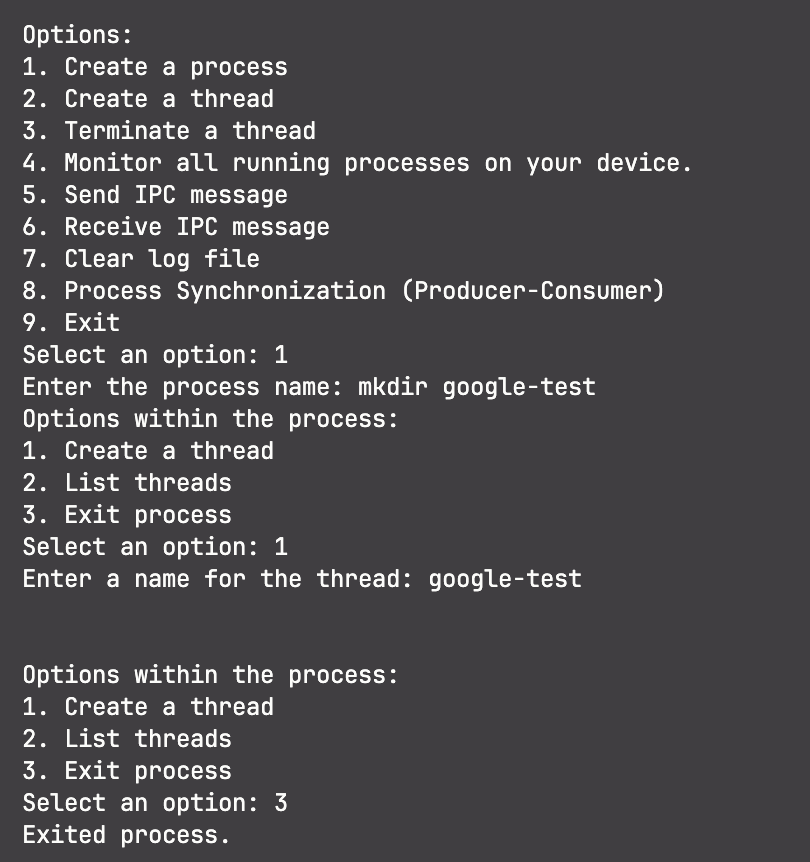
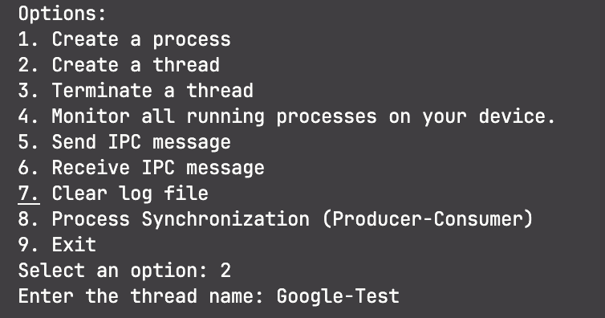
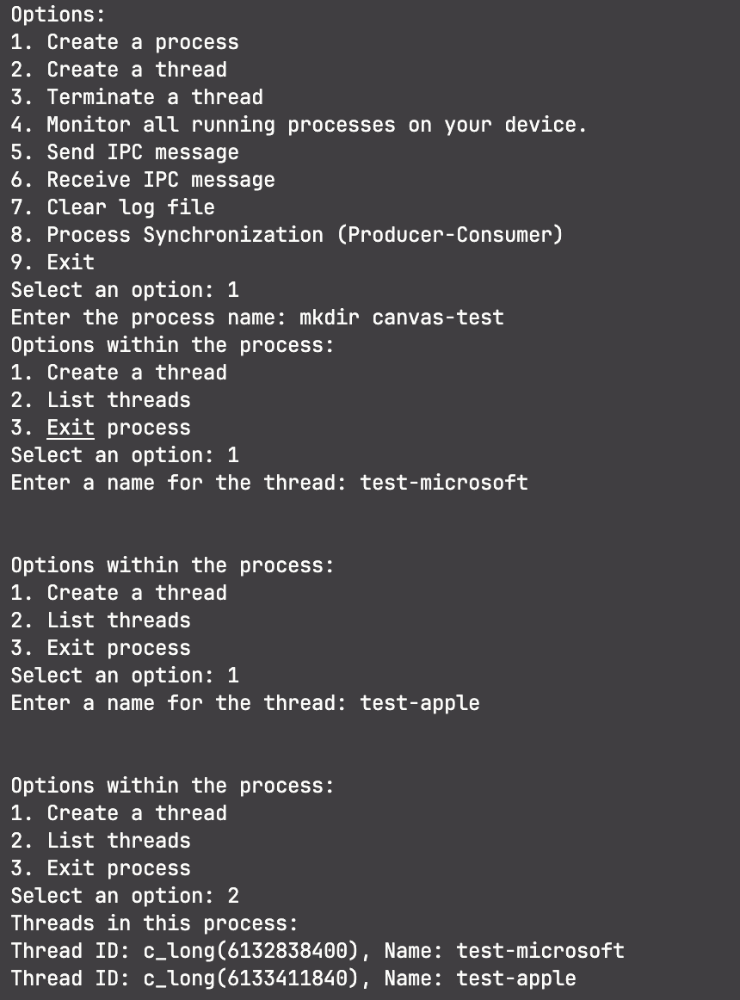
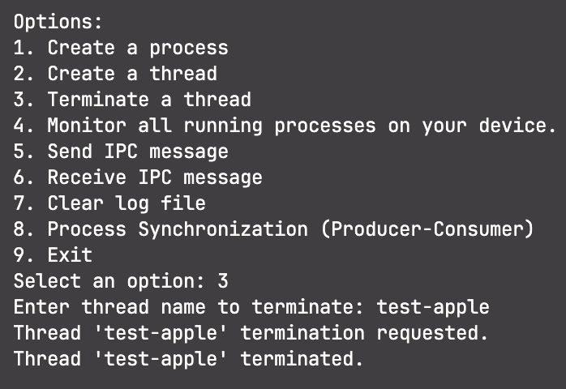
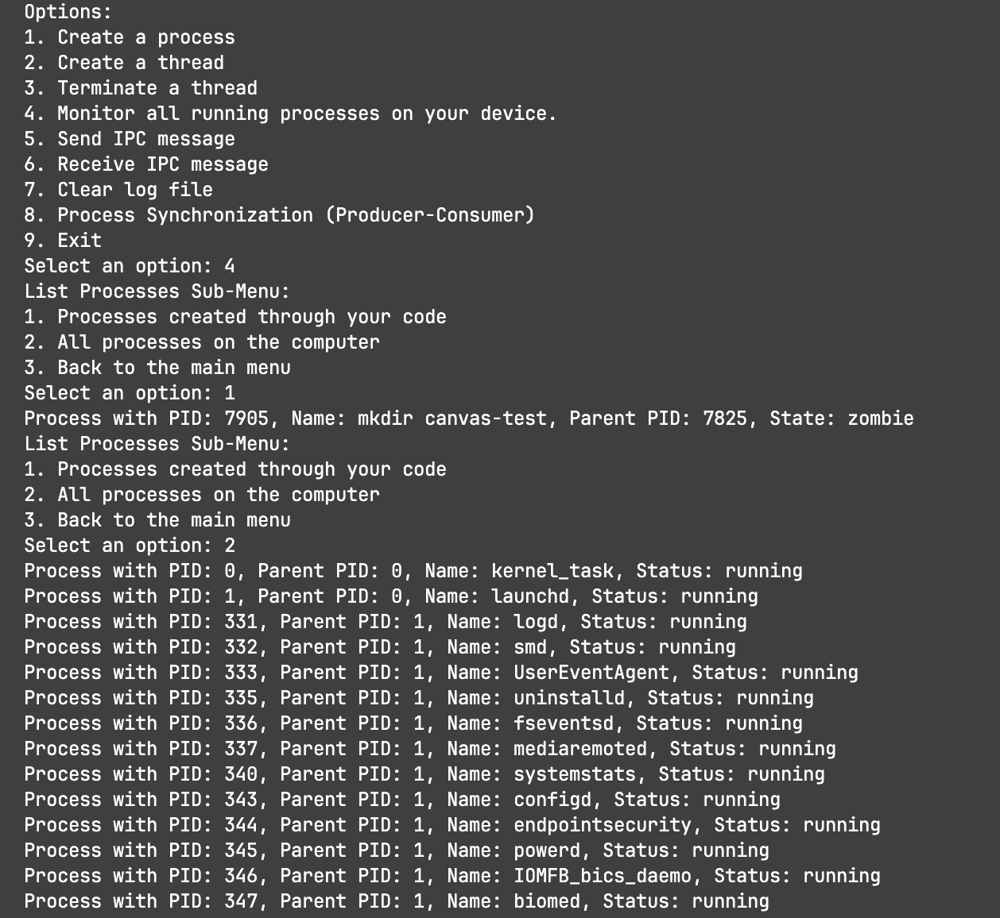
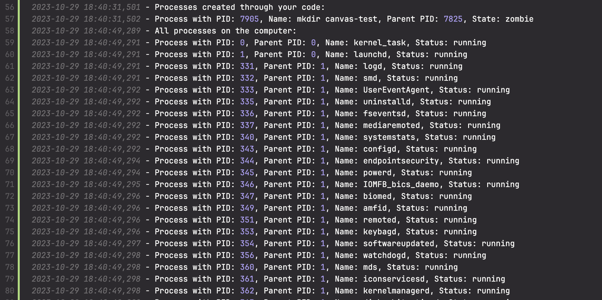
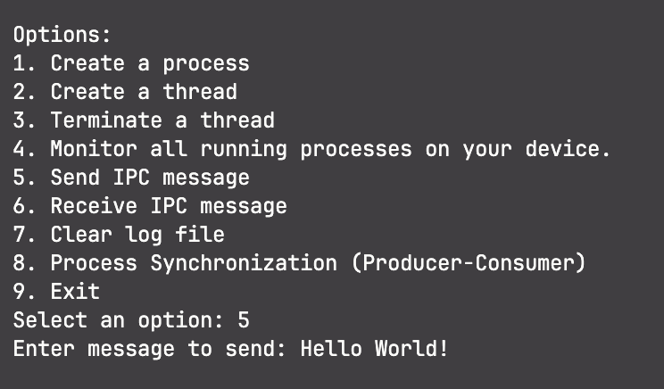
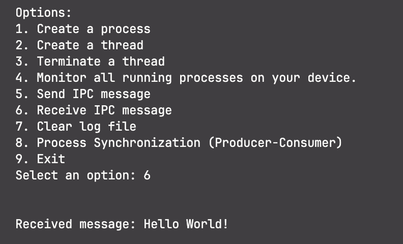
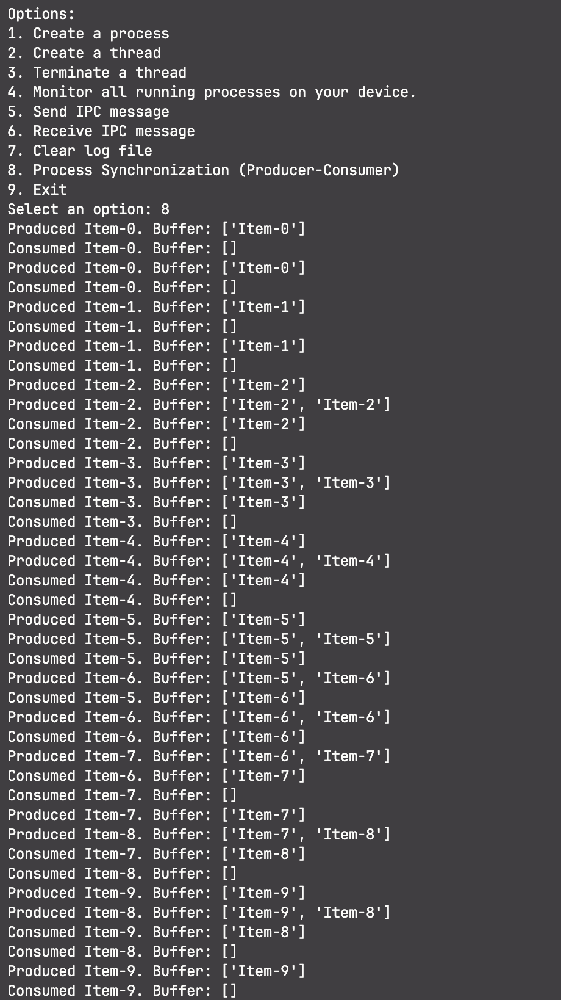
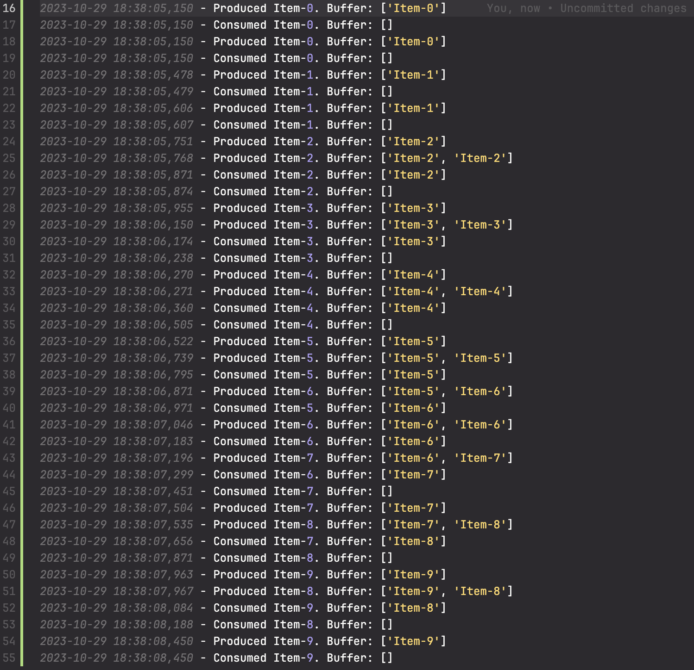

# Advanced Process Manager with Process Synchronization

## Project Overview

The goal of this project is to design and implement an advanced Process Manager with an emphasis on process synchronization. This Process Manager will allow users to create, manage, and synchronize processes in a multi-threaded environment. It will provide a command-line interface for process creation, management, and synchronization, and it will use system calls for process and thread control.

## Implemented Functionalities
This Process Manager project includes the following functionalities:
1. Process Creation
2. Process Management (Listing, Termination, and Monitoring)
3. Thread Support (Thread Creation and Listing)
4. Inter-Process Communication (IPC)
5. Process Synchronization (Producer-Consumer)
6. Command-Line Interface (CLI)
7. Logging and Reporting

## Table of Contents
1. [Project Overview](#project-overview)
2. [Installation](#installation)
3. [Usage Menu](#usage-menu)
4. [Functionality Test: Process Creation](#functionality-test-process-creation)
5. [Functionality Test: Thread Creation](#functionality-test-thread-creation)
6. [Functionality Test: Thread Termination](#functionality-test-thread-termination)
7. [Functionality Test: List Processes](#functionality-test-list-processes)
8. [Functionality Test: Inter-Process Communication (IPC)](#functionality-test-inter-process-communication-ipc)
9. [Functionality Test: Process Synchronization (Producer-Consumer)](#functionality-test-process-synchronization-producer-consumer)
10. [Logging and Reporting](#logging-and-reporting)
11. [Discussion](#discussion)

## Installation
1. **Ensure you have Python 3.11.6 installed. You can download Python 3.11.6 from the official Python website**: [Python Downloads](https://www.python.org/downloads/release/).

2. **Clone the repository and cd into it**:
   ```bash
      git clone https://github.com/Love-P/Advanced-Process-Manager.git
      cd Advanced-Process-Manager
   ```

3. **Create a Virtual Environment** (recommended):
   - On Windows:
     - Open the Command Prompt.
     - Navigate to your project directory using the `cd` command.
     - Activate the virtual environment:
       ```bash
       venv\Scripts\activate
       ```

   - On macOS and Linux:
     - Open the Terminal.
     - Navigate to your project directory using the `cd` command.
     - Activate the virtual environment:
       ```bash
       source venv/bin/activate
       ```

4. **Install Requirements**:
   In your project directory (with the virtual environment activated if you created one), install the required packages using the following command:
   
   ```bash
   pip install -r requirements.txt

## Usage Menu

```bash
Options:
1. Create a process
2. Create a thread
3. Terminate a thread
4. Monitor all running processes on your device.
5. Send IPC message
6. Receive IPC message
7. Clear log file
8. Process Synchronization (Producer-Consumer)
9. Exit
Select an option:
```

# Functionality Test: Process Creation

## Test Description
This test aims to verify the ability to create new processes within the Process Manager.

## Test Procedure
1. Run the Process Manager.
2. Select the option to create a new process.
3. Enter a unique process name and observe the process creation.

## Expected Result
- A new process with the specified name is created.
- The child process is executed independently, and a process menu is available for interaction.
- The main process should continue running and be capable of managing the child process.

## Explanation
This test ensures that the Process Manager successfully creates and manages new processes. It involves the use of the os.fork() function to create new processes, demonstrating the system's capability to run multiple processes concurrently.



---

# Functionality Test: Thread Creation

## Test Description
This test focuses on the ability to create threads within a process in the Process Manager. There is the ability to create a single thread, or multi-threads.

## Test Procedure (Single Thread)
1. Run the Process Manager.
2. Create a new thread.
4. Enter a unique thread name and observe the thread creation.

## Expected Result
- A new thread with the specified name is created.
- The thread's execution can be monitored and controlled.

## Explanation
This test validates the Process Manager's capability to manage single thread creation. It involves the use of the libc.pthread_create function to create threads and demonstrates the system's ability to handle multi-threaded applications.



---

## Test Procedure (Multi-Thread)
1. Run the Process Manager.
2. Create a new process.
3. Within the process menu, select the option to create a new thread.
4. Enter a unique thread name and observe the thread creation.

## Expected Result
- A new thread with the specified name is created within the child process.
- The thread's execution can be monitored and controlled.
- Multiple threads within the same process should work independently.

## Explanation
This test validates the Process Manager's capability to manage multiple threads within a process. It demonstrates how threads within a process can function independently, illustrating the concept of multi-threading.



---

# Functionality Test: Thread Termination

## Test Description
This test assesses the ability to terminate threads within a process in the Process Manager.

## Test Procedure
1. Run the Process Manager.
2. Create a new process.
3. Create multiple threads within the process.
4. Select the option to terminate a thread within the process menu.
5. Enter the name of the thread to be terminated and confirm the termination.

## Expected Result
- The specified thread is successfully terminated.
- The remaining threads continue to execute without disruption.
- The Process Manager effectively handles thread termination requests.

## Explanation
This test verifies that the Process Manager can manage the termination of individual threads. It involves the use of the libc.pthread_cancel and libc.pthread_join functions for requesting and confirming thread termination.



---

# Functionality Test: List Processes

## Test Description
This test evaluates the capability of the Process Manager to list and provide information about running processes. It includes the option to list processes created through the code and all processes on the computer.

## Test Procedure
1. Run the Process Manager.
2. Select the option to list processes.
3. Choose to list processes created through your code or all processes on the computer.
4. Observe the displayed information about the processes.

## Expected Result
- If the user selects "Processes created through your code," the Process Manager successfully lists and displays information about processes created by the script. The information includes the process PID, parent PID, name, and status.
- If the user selects "All processes on the computer," the Process Manager lists and displays information about all processes running on the computer, not limited to those created by the script.

## Explanation
This test ensures that the Process Manager can accurately list and provide information about processes. It offers insight into both processes created by the code and all processes on the computer. The test uses the psutil library to gather process information.



---

# Functionality Test: Inter-Process Communication (IPC)

## Test Description
This test focuses on the capability of the Process Manager to transmit and receive messages between processes via Inter-Process Communication (IPC).

## Test Procedure (Send Message)
1. Run the Process Manager.
2. Select the option to send an IPC message.
3. Enter a message and send it to another process.

## Expected Result
- The message is successfully sent to the designated process.
- The recipient process receives the message and can display it.

## Explanation
This test validates the Process Manager's ability to send messages between processes using IPC. It uses named pipes (FIFOs) for inter-process communication and non-blocking reads to receive messages.



---

## Test Procedure (Receive Message)
1. Run the Process Manager.
2. Select the option to receive an IPC message.
3. Wait for a message to be sent from another process.

## Expected Result
- The process successfully receives a message sent by another process.
- The received message can be displayed.

## Explanation
This test verifies the Process Manager's ability to receive messages sent by other processes using IPC. It uses non-blocking reads to handle IPC message reception.


---

# Functionality Test: Process Synchronization (Producer-Consumer)

## Test Description
This test evaluates the process synchronization functionality within the Process Manager, focusing on the Producer-Consumer problem.

## Test Procedure
1. Run the Process Manager.
2. Select the option to execute the Producer-Consumer example.
3. Observe the behavior of the producer and consumer threads as they interact with the shared buffer.

## Expected Result
- Two producer threads and two consumer threads are created.
- The producer threads successfully produce items and place them in the shared buffer.
- The consumer threads successfully consume items from the shared buffer.
- The synchronization mechanisms, including mutex, empty, and filled semaphores, operate effectively to ensure thread safety.
- The Producer-Consumer problem is simulated with proper synchronization.

## Explanation
This test demonstrates the Process Manager's capability to implement process synchronization and coordinate threads to solve the classic Producer-Consumer problem. It involves the use of semaphores and mutexes to achieve synchronization.



---

# Logging and Reporting

The Advanced Process Manager utilizes logging extensively to capture essential information about processes, threads, IPC activities, and synchronization events. All this logged information is stored in a file called `processes.log`.

## Logging Details

- **Process and Thread Creation**: Whenever a process or thread is created, details such as the process ID (PID), thread ID (TID), name, and status are recorded in the log.

- **Thread Termination**: When a thread is terminated, the log records the action, including the name of the terminated thread.

- **Inter-Process Communication (IPC)**: Messages sent via IPC are logged, including the source process, target process, and message content. This provides a comprehensive record of IPC activities within the Process Manager.

- **Process Synchronization (Producer-Consumer)**: Events in the producer-consumer example, including production and consumption of items, are logged to reflect the synchronization between producer and consumer threads.

- **Listing Processes and Threads**: Information about listed processes and threads, whether generated by the script or all processes on the computer, is captured in the log.

- **Log Clearance**: The ability to clear the log file is provided through the "Clear log file" option, ensuring the log can be reset for new sessions.

## Reporting and Analysis

The log file serves as a valuable tool for analyzing process and thread behavior, debugging issues, and understanding how synchronization mechanisms work in the Process Manager. It enables users to review past activities, investigate errors, and trace the sequence of events in both individual processes and multi-threaded contexts.

## Accessing the Log File

The `processes.log` file is created in the root directory of the Process Manager project. Users can access this file to view and analyze the logged information.

### Log File Location

```plaintext
Advanced-Process-Manager/
├── processes.log
├── ...
```
# Discussion

The Advanced Process Manager project represents a comprehensive and multifaceted system for managing processes and threads in a multi-threaded environment. This discussion aims to provide an overview of the project results, including its functionalities, design, and the broader implications of its capabilities.

## Comprehensive Functionality

The project successfully allows the creation of new processes, each with its menu for further interactions. This modularity in process creation lends itself well to managing different tasks or services within the system. The management options for processes, including process listing and termination, offer essential control over these entities.

## Thread Support

The support for threads within processes significantly enhances the project's functionality. It demonstrates the ability to handle multi-threaded applications and can serve as a basis for more complex parallel computing tasks. Thread creation and termination are well-implemented, showcasing the control the Process Manager has over its threads.

## Inter-Process Communication (IPC)

The IPC feature, allowing messages to be sent between processes, is a valuable addition. It emphasizes the ability to coordinate actions and share information across processes. In distributed and networked systems, IPC becomes crucial, and this functionality demonstrates its feasibility.

## Process Synchronization

One of the most noteworthy aspects of the project is the process synchronization example, the Producer-Consumer problem. By simulating real-world synchronization challenges, it highlights the capabilities of the Process Manager in orchestrating complex thread interactions. Semaphore-based synchronization ensures that only one thread accesses shared resources at a time, a fundamental requirement in parallel computing.

## Logging and Reporting

The inclusion of a detailed logging system, where all relevant information is recorded in the `processes.log` file, enhances the project's accountability and visibility. This log provides a historical record of processes, threads, IPC activities, and synchronization events. It serves as a useful tool for debugging, performance analysis, and gaining insights into system behavior. The "Log Clearance" feature allows users to reset the log for new sessions, maintaining log integrity.

## Real-World Applicability

The Advanced Process Manager is not just an isolated demonstration of concepts but a practical tool. It can be employed in a variety of scenarios:

- **System Administration**: It provides insights into all running processes on a system, assisting administrators in monitoring and managing system resources.

- **Parallel Computing**: The support for multi-threaded applications and IPC is crucial for parallel computing, where tasks are broken down and executed in parallel for performance gains.

- **Distributed Systems**: IPC is vital in distributed systems where processes on different machines need to communicate.

- **Educational Tool**: It can be a valuable tool for educational purposes, illustrating process management and synchronization concepts to students.

## Future Enhancements

While the Advanced Process Manager demonstrates impressive capabilities, there's always room for expansion and improvement. Some areas of future enhancement include:

- **Enhanced IPC**: Extending IPC with more advanced communication mechanisms like shared memory and message queues.

- **User Interface**: Developing a graphical user interface (GUI) for more user-friendly interaction.

- **Resource Monitoring**: Adding resource monitoring capabilities, such as CPU and memory usage, would be valuable for system administrators.

## Conclusion

The Advanced Process Manager is a versatile project that offers extensive functionality for process and thread management, IPC, and process synchronization. The project demonstrates a fundamental understanding of process management and synchronization concepts and serves as a practical tool with real-world applications. Its meticulous logging and reporting ensure transparency and accountability in system operations. This project lays the foundation for further exploration and development of process management and parallel computing tools, benefiting system administrators, developers, and educators.

## Copyright (c) 2023 Love Patel
